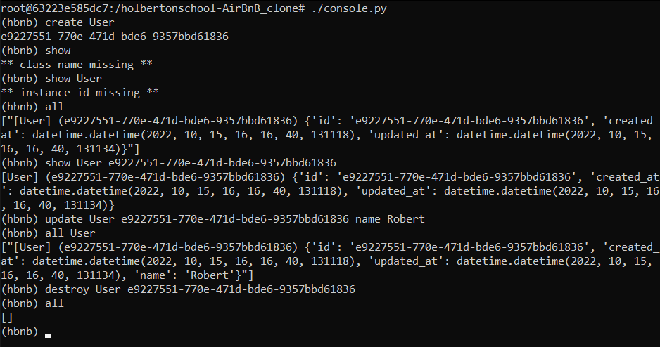

<div id="top"></div>

<!-- PROJECT LOGO -->
<br />
<div align="center">
  <a href="https://github.com/SchneiderSix/holbertonschool-AirBnB_clone">
    
  </a>

<h3 align="center">AirBnB clone - The console</h3>

  <p align="center">
    Back-end, storage engine (json) 
    <br />
    <a href="https://github.com/SchneiderSix/holbertonschool-AirBnB_clone"><strong>Explore the docs »</strong></a>
    <br />
    <br />
  </p>
</div>


<!-- TABLE OF CONTENTS -->
<details>
  <summary>Table of Contents</summary>
  <ol>
    <li>
      <a href="#about-the-project">About The Project</a>
    </li>
    <li>
      <a href="#getting-started">Getting Started</a>
    </li>
    <li><a href="#usage">Usage</a></li>
    <li><a href="#examples">Examples</a></li>
    <li><a href="#flowchart">Flowchart</a></li>
    <li><a href="#contact">Contact</a></li>
  </ol>
</details>


<!-- ABOUT THE PROJECT -->
## About The Project

This is a mandatory project for Holberton School made by Salvador Borit and Juan Matias Rossi from cohort 18. This is the first part of AirBnB clone (six in total).

<p align="right">(<a href="#top">back to top</a>)</p>


<!-- GETTING STARTED -->
## Getting Started

In this early stage of the package we made a console with custom commands to manipulate different objects and save them in json format.

<p align="middle"><b>Clone the repository</b>

``` javascript
git clone https://github.com/SchneiderSix/holbertonschool-AirBnB_clone.git
```

<p align="right">(<a href="#top">back to top</a>)</p>

<!-- USAGE EXAMPLES -->
## Usage

You can create, delete, update, display string representation of a single object, objects of same group (class) or all objects.
Type `help` to see every command. Types of objects: `Amenity, City, Place, Review, State, User`.
The objects will be stored in json format, in a file called `file.json`. The file is going to appear in the root directory.
If you want to quit just use the command `quit` or `ctrl + D`.

* `Interactive mode`
  Execute the file `console.py` like this `./console.py`.

* `Non-interactive mode`
  Use echo with the command wanted and a pipeline with `console.py`, like this `echo "all" | ./console.py`.

<p align="middle"><b>Create + type</b>

``` javascript
create User
```

<p align="middle"><b>Show + type + id</b>

``` javascript
show User e9227551-770e-471d-bde6-9357bbd61836
```

<p align="middle"><b>All + type(optional, shows all objects of that type)</b>

``` javascript
show all
```

<p align="middle"><b>Update + type + id + attribute + value</b>

``` javascript
update User e9227551-770e-471d-bde6-9357bbd61836 name Robert
```

<p align="middle"><b>Destroy + type + id</b>

``` javascript
destroy User e9227551-770e-471d-bde6-9357bbd61836
```

<p align="right">(<a href="#top">back to top</a>)</p>

<!-- FLOWCHART -->
## Flowchart


<p align="right">(<a href="#top">back to top</a>)</p>

<!-- EXAMPLES -->
## Examples




<p align="right">(<a href="#top">back to top</a>)</p>

<!-- CONTACT -->
## Contact

* Salvador Borit - [Linkedin](https://www.linkedin.com/in/salvadorborit) - 5084@holbertonstudents.com
* Juan Matías Rossi - [Instagram](https://www.instagram.com/jumaro35/) - [Linkedin](https://www.linkedin.com/in/jmrossi6/) - knuckles116635@gmail.com

Project Link: [https://github.com/SchneiderSix/holbertonschool-AirBnB_clone](https://github.com/SchneiderSix/holbertonschool-AirBnB_clone)

<p align="right">(<a href="#top">back to top</a>)</p>
